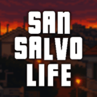

<!-- PROJECT LOGO -->
 

  

    
    &nbsp;
    &nbsp;
    
  

<h3 align="center">San Salvo Life</h3>

  

    Questa repository contiene il videogioco RPG in stile pixel art realizzato dai ragazzi dell'<em>Istituto Istruzione Superiore "Enrico Mattei"</em> di Vasto (CH), frutto del laboratorio PLS "<em>Cosa si cela dietro ai pixel: imparare a programmare sviluppando un RPG</em>" offerto dall'<em>Università degli Studi dell'Aquila</em>.
     
    <a href="https://github.com/CarlinoCalogero/cosa-si-cela-dietro-ai-pixel"><strong>Esplora il materiale didattico »</strong></a>
  

<!-- TABLE OF CONTENTS -->

  
Indice

  <ol>
    <li>
      <a href="#cosa-si-cela-dietro-ai-pixel-imparare-a-programmare-sviluppando-un-rpg">Cosa si cela dietro ai pixel: imparare a programmare sviluppando un RPG</a>
    </li>
    <li>
      <a href="#riguardo-questa-repository">Riguardo questa repository</a>
      <ul>
        <li><a href="#built-with">Built With</a></li>
      </ul>
    </li>
  </ol>

<!-- ABOUT THE PROJECT -->
## Cosa si cela dietro ai pixel: imparare a programmare sviluppando un RPG
Il materiale didattico *"Cosa si cela dietro ai pixel: imparare a programmare sviluppando un RPG"* è un modo creativo per introdurre alla programmazione i principianti, tramite un manuale e codice di esempio, basati su un videogioco in uscita su Steam.

Ciascun capitolo si apre con una scena del gioco completato, la quale viene analizzata al fine di scomporla in componenti che saranno poi oggetto di sviluppo.

Il manuale fornisce repository iniziali e finali per ogni capitolo, facilitando l'apprendimento pratico. 

I concetti di programmazione sono introdotti gradualmente, con esempi e casi d'uso, come nel caso della spiegazione di variabili e scope durante la creazione del player.

(<a href="#readme-top">torna su</a>)

## Riguardo questa repository
Questa repository contiene il videogioco RPG in stile pixel art realizzato dai ragazzi dell'<em>Istituto Istruzione Superiore "Enrico Mattei"</em> di Vasto (CH), frutto del laboratorio PLS "<em>Cosa si cela dietro ai pixel: imparare a programmare sviluppando un RPG</em>" offerto dall'<em>Università degli Studi dell'Aquila</em>.

Questa repository include due cartelle:
* `game/`, che contiene il progetto Godot del videogioco
* `project/`, che contiene tutti i progetti degli assets realizzati dagli studenti e utilizzati all'interno del videogioco

(<a href="#readme-top">torna su</a>)

### Built With
* [![Godot][Godot]][Godot-url]

(<a href="#readme-top">torna su</a>)

<!-- MARKDOWN LINKS & IMAGES -->
<!-- https://www.markdownguide.org/basic-syntax/#reference-style-links -->
[Godot]: https://img.shields.io/badge/Godot%20Engine%204.1.3-20232A?style=for-the-badge&logo=godotengine
[Godot-url]: https://godotengine.org/
